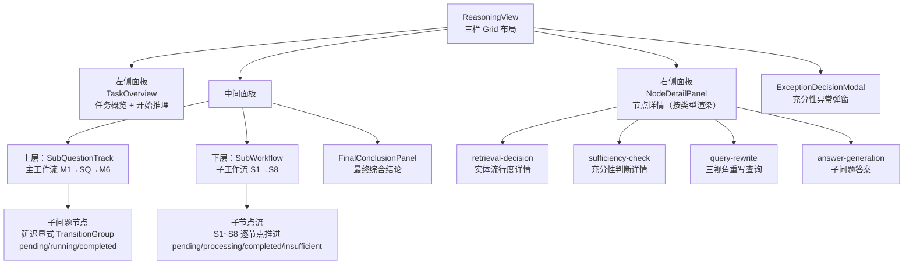
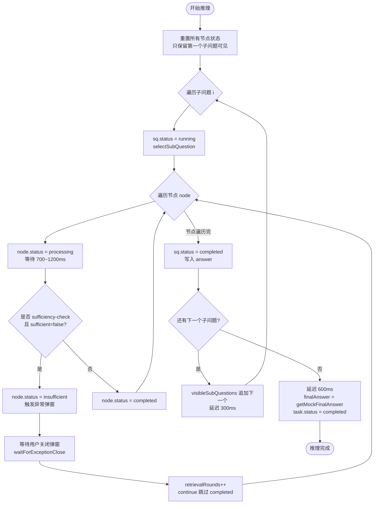
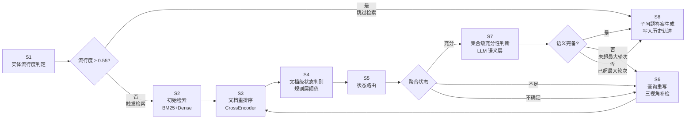
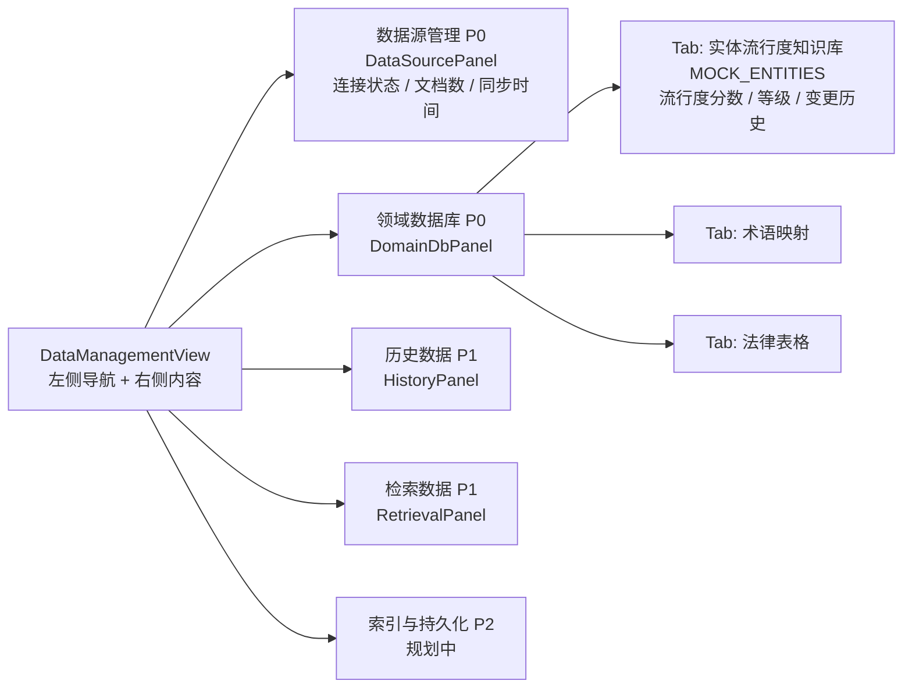

# 系统架构图

## 1. 整体架构

```mermaid
graph TB
    subgraph Browser["浏览器 (SPA)"]
        subgraph Router["Vue Router"]
            R1["/  首页"]
            R2["/reasoning/:id  推理展示"]
            R3["/data-management  数据管理"]
            R4["/system-config  系统配置"]
        end

        subgraph Stores["Pinia 状态管理"]
            S1["reasoningStore\n推理状态 / 节点状态 / 异常弹窗"]
            S2["taskQueueStore\n多任务队列 / 多主问题检测"]
            S3["configStore\n系统参数配置"]
        end

        subgraph Views["视图层 (Views)"]
            V1["HomeView\n任务入口"]
            V2["ReasoningView\n推理展示"]
            V3["DataManagementView\n数据资产管理"]
            V4["SystemConfigView\n系统配置"]
        end

        subgraph Mock["Mock 数据层"]
            M1["mock/reasoning.js\nMOCK_TASK / SUB_QUESTIONS\nSQ1~SQ3_NODES / FINAL_ANSWER"]
            M2["mock/dataManagement.js\nDATA_SOURCES / ENTITIES\nHISTORY / RETRIEVAL / METRICS"]
        end
    end

    Router --> Views
    Views --> Stores
    Stores --> Mock
```

---

## 2. 推理展示页组件架构

```mermaid
graph TB
    RV["ReasoningView\n三栏 Grid 布局"]

    RV --> LP["左侧面板\nTaskOverview\n任务概览 + 开始推理"]
    RV --> CP["中间面板"]
    RV --> RP["右侧面板\nNodeDetailPanel\n节点详情（按类型渲染）"]
    RV --> EM["ExceptionDecisionModal\n充分性异常弹窗"]

    CP --> UL["上层：SubQuestionTrack\n主工作流 M1→SQ→M6"]
    CP --> LL["下层：SubWorkflow\n子工作流 S1→S8"]
    CP --> FC["FinalConclusionPanel\n最终综合结论"]

    UL --> SQ["子问题节点\n延迟显式 TransitionGroup\npending/running/completed"]
    LL --> SN["子节点流\nS1~S8 逐节点推进\npending/processing/completed/insufficient"]

    RP --> ND1["retrieval-decision\n实体流行度详情"]
    RP --> ND2["sufficiency-check\n充分性判断详情"]
    RP --> ND3["query-rewrite\n三视角重写查询"]
    RP --> ND4["answer-generation\n子问题答案"]
```

---

## 3. 推理状态机（simulateRun 流程）

```mermaid
flowchart TD
    A([开始推理]) --> B[重置所有节点状态\n只保留第一个子问题可见]
    B --> C{遍历子问题 i}
    C --> D[sq.status = running\nselectSubQuestion]
    D --> E{遍历节点 node}
    E --> F[node.status = processing\n等待 700~1200ms]
    F --> G{是否 sufficiency-check\n且 sufficient=false?}
    G -- 是 --> H[node.status = insufficient\n触发异常弹窗]
    H --> I[等待用户关闭弹窗\nwaitForExceptionClose]
    I --> J[retrievalRounds++\ncontinue 跳过 completed]
    J --> E
    G -- 否 --> K[node.status = completed]
    K --> E
    E -- 节点遍历完 --> L[sq.status = completed\n写入 answer]
    L --> M{还有下一个子问题?}
    M -- 是 --> N[visibleSubQuestions 追加下一个\n延迟 300ms]
    N --> C
    M -- 否 --> O[延迟 600ms\nfinalAnswer = getMockFinalAnswer\ntask.status = completed]
    O --> P([推理完成])
```

---

## 4. 子工作流推理逻辑（S1→S8）

```mermaid
flowchart LR
    S1["S1\n实体流行度判定"] --> D1{流行度 ≥ 0.55?}
    D1 -- 是\n跳过检索 --> S8
    D1 -- 否\n触发检索 --> S2

    S2["S2\n初始检索\nBM25+Dense"] --> S3["S3\n文档重排序\nCrossEncoder"]
    S3 --> S4["S4\n文档级状态判别\n规则层阈值"]
    S4 --> S5["S5\n状态路由"]

    S5 --> D2{聚合状态}
    D2 -- 充分 --> S7
    D2 -- 不足 --> S6["S6\n查询重写\n三视角补检"]
    D2 -- 不确定 --> S6

    S6 --> S3

    S7["S7\n集合级充分性判断\nLLM 语义层"] --> D3{语义完备?}
    D3 -- 是 --> S8["S8\n子问题答案生成\n写入历史轨迹"]
    D3 -- 否\n未超最大轮次 --> S6
    D3 -- 否\n已超最大轮次 --> S8
```

---

## 5. 数据管理页模块结构

```mermaid
graph LR
    DMV["DataManagementView\n左侧导航 + 右侧内容"]

    DMV --> DS["数据源管理 P0\nDataSourcePanel\n连接状态 / 文档数 / 同步时间"]
    DMV --> DD["领域数据库 P0\nDomainDbPanel"]
    DMV --> HI["历史数据 P1\nHistoryPanel"]
    DMV --> RE["检索数据 P1\nRetrievalPanel"]
    DMV --> IX["索引与持久化 P2\n规划中"]

    DD --> ET["Tab: 实体流行度知识库\nMOCK_ENTITIES\n流行度分数 / 等级 / 变更历史"]
    DD --> TM["Tab: 术语映射"]
    DD --> LT["Tab: 法律表格"]
```
